# Facial Landmark Localization with Recurrent Cascading CNNs

## Project description

Facial landmark localization (FLL) is an important computer vision problem involving the regressing of keypoints from a face in an image. This task is difficult due to the wide variety of facial expressions, pose variations, and keypoint occlusion by angle, lighting, and obstructions such as glasses and hair. Previous methods involved fitting a model to lower-dimensional representations of the face, while today, convolutional nueral networks are a major focus of research in this area. In particular, cascading CNNs, which involve chaining CNN modules with correlated tasks, such as constructing a featurized representation of the face, mapping a heatmap to possible keypoint locations, and regressing the keypoints themselves, are shown to be promisingly capable. In this project, I plan to adapt successful Cascading CNN models from the literature with a focus on reducing parameters and increasing robustness to variant poses with incorporation of self-attention (SA) mechanisms. I beleive SA in the form of convolutional self-attention and spatial transformers will yield a model that can map long-range dependencies in  images more effectively (an important aspect of heatmap construction), while increasing its accuracy on otherwise-tricky poses and expressions.

## The Model

My model is a fusion of the ideas of (1) and (2) featuring a recurrent cascading CNN (RCCNN) scheme that has been shown to increase the accuracy of heatmap and regression predictions on each pass. Loss is assessed after each recurrent estimationto assist with backpropagation  

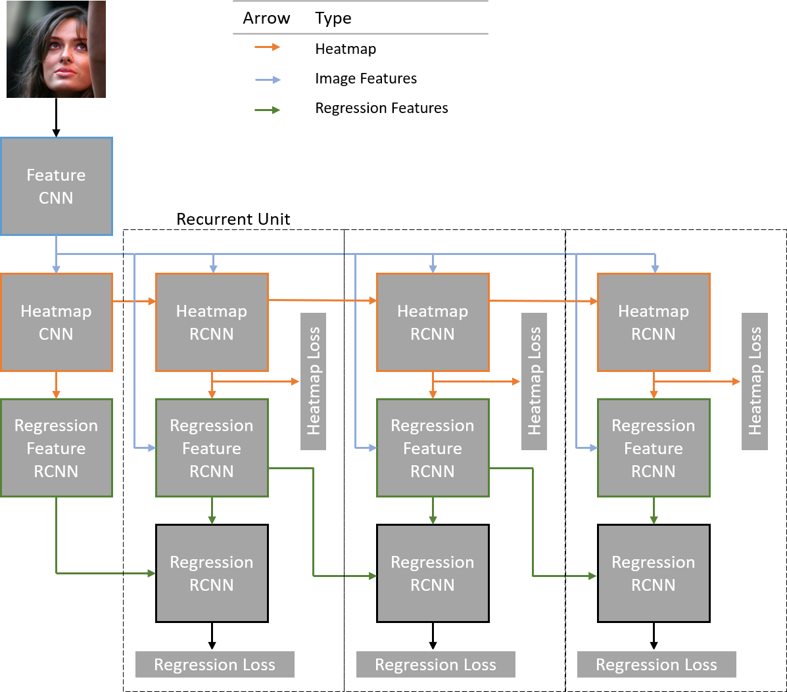 
Figure 1. Recurrent cascading CNN diagram.

## Training Objective

The regression module were trained to minimize the mean squared error between their predictions and the true landmark locations, while the heatmap module minimized the cross-entropy between their predicted probabilistic heatmap and a target generated by placing a bivariate gaussian with standard-deviation of 2.5 pixels on each landmark.
  

## Input Pipeline

Pre-processing for images fed into the network required careful execution, as raw images from the HELEN dataset used for training had often had multiple faces in the frame, faces off-center, and widely varying image sizes. Furthermore, common data augmentations such as zoom, cropping, and rotation affect the image content as well as the location of the landmarks, so positional augmentations made must be made to both. The HELEN dataset contains 2300 images, which is unlikely to train a generalizable model for this complex localization function, so these augmentations are a must. 

In order to facilitate these augmentations, I first created a new dataset in which the maximum image size was reduced to approximately 750 x 750 pixels to reduce read-time, then these images were piped through the following steps to produce stochastic close-crops of subjects' faces:

 | Step | Description | Example |   
 | --- | --- | --- |
 | 0 | Rotate the face randomly by some angle constrained to +- 10-15 degrees.  Use a rotation matrix to rotate the keypoints matrix accordingly. | |
 | 1 | Find the minimum box shape that will contain all keypoints by taking  the maximum and minimum along both axes | 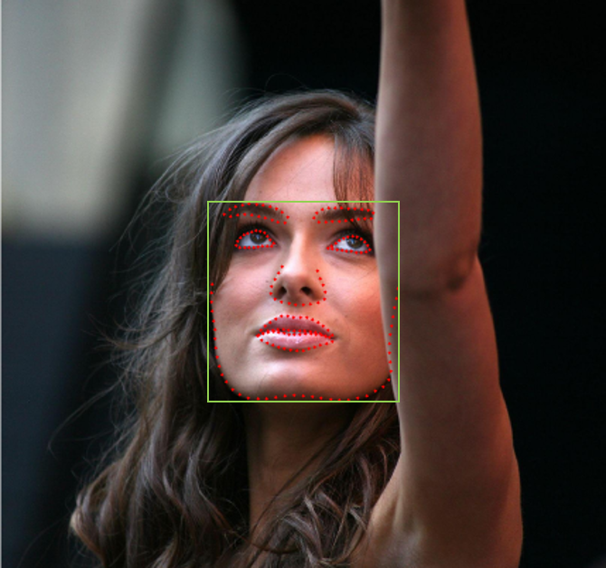 |
 | 2 | Increase height of box with scalar constant to include forehead (1.4 in my case) | 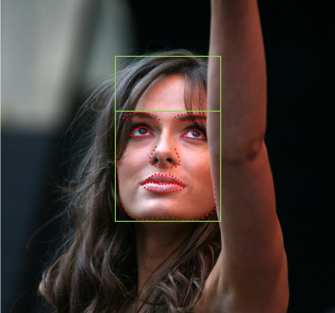 |
 | 3 | Define largest and smallest possible crops, smallest being the size in step 1,   the largest being a box that which the area is some pre-defined constant larger   than the area covered by the face.   This scale, for which I used 2.0, controls zoom.   Box size was also limited by boundary effects in the image.| 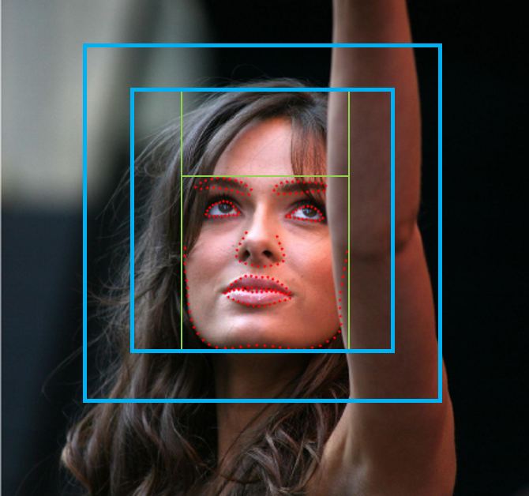 |
 | 4 | Sample a box size from all possible sizes (uniformly),   then define the possible region in which the upper left corner   might be placed such that this box contains all keypoints. | 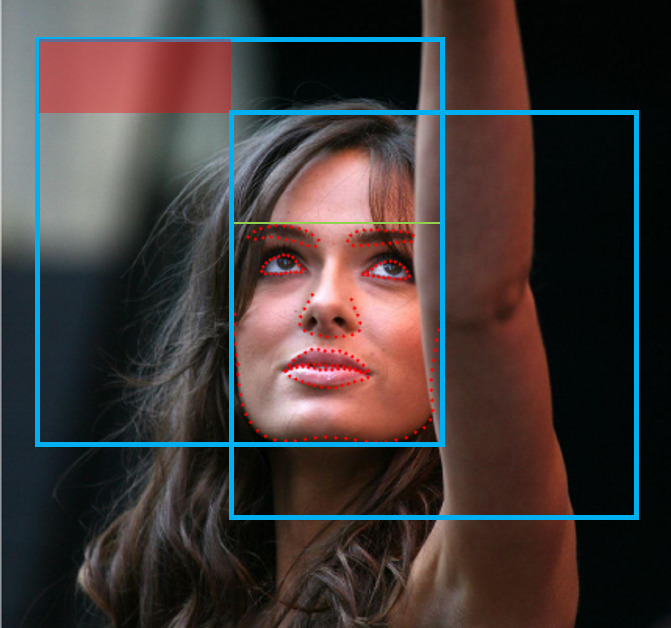 |
 | 5 | Sample a point from this region (uniformly) to be the upper left corner of the crop box. This fulfils the role of translation augmentation. | 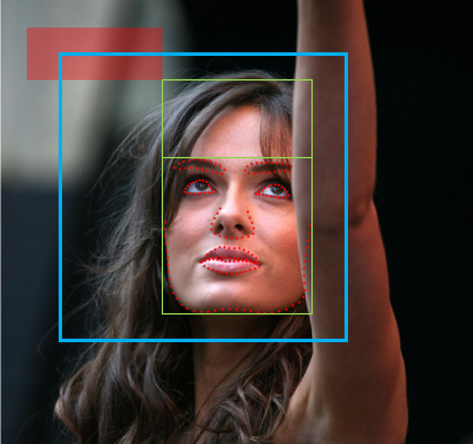 |
 | 6 | Crop the face from the stochastically-defined bounding box,   then resize image to 256x256 for infeed to the neural network.   Translate the keypoint matrix accordingly.   This step may be followed by more augmentations such as brightness and contrast,   as long as those augmentation do not affect the positions of the keypoints in the image. | 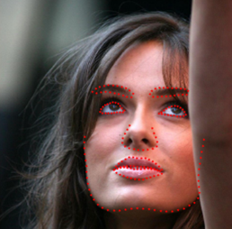 |
 | 7 | Calculate the gaussians for heatmap targets from the final keypoint locations | |

I planned to have this process done online during training, but augmenting the images and calculating the gaussian heatmap targets on-the-fly proved to be too intensive for my compute resources, even when using multiple workers. As a quick patch, I used Spark to generate 7000 samples using the procedure outlined above, then used python generators fed into tensorflow processing load samples. 

## Results

Train time: 24 hrs, 2e6 samples
Training set: 7000 pre-augmented samples, 3 from each image in the original HELEN dataset
Test set: 300 randomly-selected samples removed from the training set

The train and test error continues to decrease gradually after 24 hours, but I need my machine for other projects and so I cut the training short. Below are a sample of localizations from the test set.

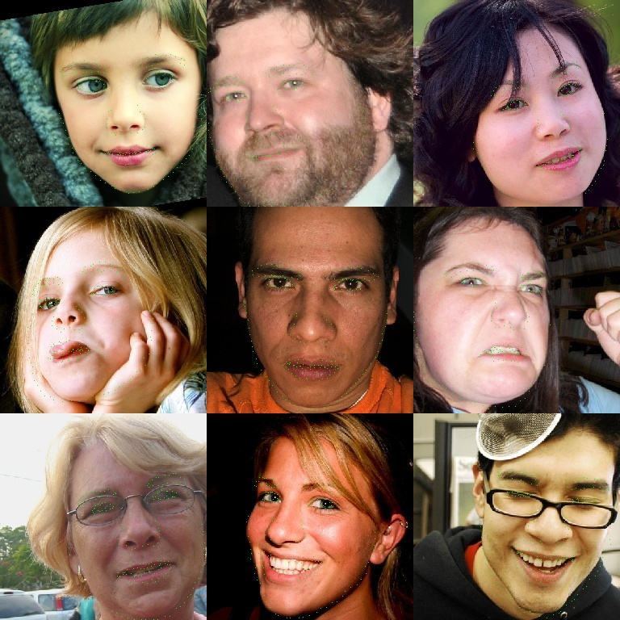
 Figure 2. Samples of localizations on test set. 

Purely from observation, the model seems to be making quality predictions and is generalizing well. Surprisingly, the most error-prone areas appear to be the points surrounding the face rather than in densely-labeled regions like the eyes and lips, which are fit to highly expressive areas of the face where quality placement depends on coordinating multiple landmarks for a smooth edge. This contradicts my predictions, and might be because there are fewer points bounding the face, so they contribute less to the loss. This may be rectified with loss weighting, or just more training. The per-landmark loss is plotted in Figure 3, noted as the size of the dot. Indeed, the face-bounding points showed the highest errors. 

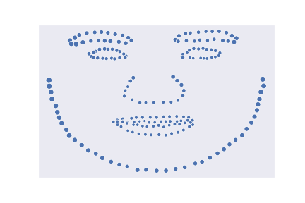
 Figure 3. Per-landmark loss. 

Judging by the discrepancy in testing and training loss for landmark localization, shown in Figure 4, the model is overfitting to the training set. This could be due to things:

1. I am training with positionally-static images. For high dimensional data, this causes a model to be prone to overfitting.
2. I have not regularized my network.

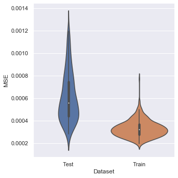
 Figure 4. Training vs. testing loss. 

Regularizing my network too much will decrease its expressive capacity, and since the model has not managed to solve the training set, I will opt for this approach for reducing test set error. Instead, I fill focus on online augmented sample generation to make a more robust and generalizable model.

Lastly, I analyzed the effect of the recurrent mechanism in my localization network. Shown in Figure 5, the regression (MSE) losses decline drastically from the first to second applications, then remain static. The crossentropy heatmap loss, however, declined from cascade 1 to 2, then increased on the third pass. This suggests the heatmap network is overfitting and is not making meanful refinements after the second pass. In turn, this may be effecting the ability of the regression network to refine its prediction. To test this, I intend to make the heatmap objective more difficult by reducing the standard deviation of the heatmap gaussians from the literature suggestion 2.5, 1. Also, I will create a seperate feature stream for the regression modules to detangle the heatmap and regression objectives' gradients.

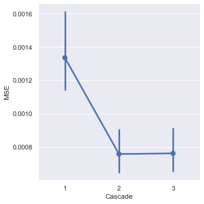 Figure 5. Regression loss with each application of the recurrent module>
 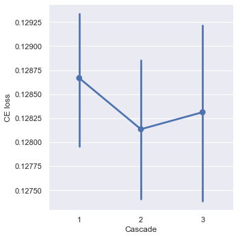 Figure 6. Crossentropy loss of the heatmap with each application of the recurrent module. 

 
## What's Next

To improve my model, I have a series of decisions to make. Since training time is so long, I have to test multiple ideas at once.
### Phase 1:
1. Find a solution for online data-augmentation. This may be renting cloud time where I can use more CPU resources for loading and augmenting data.
2. Reduce the standard deviation of the gaussian heatmap targets. They may be too coarse for landmark estimation in point-dense regions.
3. Add a seperate feature network for regression predictions.
Train and test network after making these modifications.

### Phase 2:
1. Introduce uniform prior heatmap and remove non-recurrent heatmap network. This will save 5 million parameters.
2. Incorporate self-attentive layers intead of the large 13x13 convolution in the heatmap network. This will save more parameters, and may also be more effective.

## References

1. <a href="https://arxiv.org/pdf/1805.01760.pdf">Facial Landmark Point Localization using Coarse-to-Fine Deep Recurrent Neural Network"</a>
2. <a href="https://arxiv.org/abs/1605.02914">Recurrent Human Pose Estimation</a>
