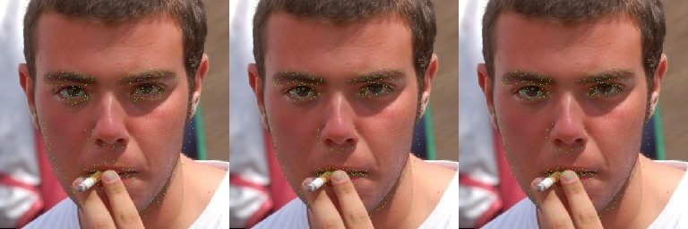
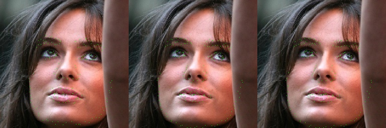

# Facial Landmark Localization with Recurrent Cascading CNNs

## Project description

Facial landmark localization (FLL) is an important computer vision problem involving the regressing of keypoints from a face in an image. This task is difficult due to the wide variety of facial expressions, pose variations, and keypoint occlusion by angle, lighting, and obstructions such as glasses and hair. Previous methods involved fitting a model to lower-dimensional representations of the face, while today, convolutional nueral networks are a major focus of research in this area. In particular, cascading CNNs, which involve chaining CNN modules with correlated tasks, such as constructing a featurized representation of the face, mapping a heatmap to possible keypoint locations, and regressing the keypoints themselves, are shown to be promisingly capable. In this project, I plan to adapt successful Cascading CNN models from the literature with a focus on reducing parameters and increasing robustness to variant poses with incorporation of self-attention (SA) mechanisms. I beleive SA in the form of convolutional self-attention and spatial transformers will yield a model that can map long-range dependencies in  images more effectively (an important aspect of heatmap construction), while increasing its accuracy on otherwise-tricky poses and expressions.

## The Model

My model is a fusion of the ideas of (1) and (2) featuring a recurrent cascading CNN (RCCNN) scheme that has been shown to increase the accuracy of heatmap and regression predictions on each pass. Loss is assessed after each recurrent estimationto assist with backpropagation  

## Training Objective

The regression module were trained to minimize the mean squared error between their predictions and the true landmark locations, while the heatmap module minimized the cross-entropy between their predicted probabilistic heatmap and a target generated by placing a bivariate gaussian with standard-deviation of 2.5 pixels on each landmark.
  

## Input Pipeline

Pre-processing for images fed into the network required careful execution, as raw images from the HELEN dataset used for training had often had multiple faces in the frame, faces off-center, and widely varying image sizes. Furthermore, common data augmentations such as zoom, cropping, and rotation affect the image content as well as the location of the landmarks, so positional augmentations made must be made to both. The HELEN dataset contains 2300 images, which is unlikely to train a generalizable model for this complex localization function, so these augmentations are a must. 

In order to facilitate these augmentations, I first created a new dataset in which the maximum image size was reduced to approximately 750 x 750 pixels to reduce read-time, then these images were piped through the following steps to produce stochastic close-crops of subjects' faces:

 | Step | Description | Example |   
 | --- | --- | --- |
 | 0 | Rotate the face randomly by some angle constrained to +- 10-15 degrees.  Use a rotation matrix to rotate the keypoints matrix accordingly. | |
 | 1 | Find the minimum box shape that will contain all keypoints by taking  the maximum and minimum along both axes |  |
 | 2 | Increase height of box with scalar constant to include forehead (1.4 in my case) |  |
 | 3 | Define largest and smallest possible crops, smallest being the size in step 1,   the largest being a box that which the area is some pre-defined constant larger   than the area covered by the face.   This scale, for which I used 2.0, controls zoom.   Box size was also limited by boundary effects in the image.|  |
 | 4 | Sample a box size from all possible sizes (uniformly),   then define the possible region in which the upper left corner   might be placed such that this box contains all keypoints. |  |
 | 5 | Sample a point from this region (uniformly) to be the upper left corner of the crop box. This fulfils the role of translation augmentation. |  |
 | 6 | Crop the face from the stochastically-defined bounding box,   then resize image to 256x256 for infeed to the neural network.   Translate the keypoint matrix accordingly.   This step may be followed by more augmentations such as brightness and contrast,   as long as those augmentation do not affect the positions of the keypoints in the image. |  |
 | 7 | Calculate the gaussians for heatmap targets from the final keypoint locations | |

I planned to have this process done online during training, but augmenting the images and calculating the gaussian heatmap targets on-the-fly proved to be too intensive for my compute resources, even when using multiple workers. As a quick patch, I used Spark to generate 7000 samples using the procedure outlined above, then used python generators fed into tensorflow processing load samples. This initial training is ongoing.

## Results

Training is onging. Given 7000 static samples and one night of training, it was evident the model was succeeding in the task of learning landmark localization, but generatlization was poor. This was evident first in the higher test set error observed during training, which suggests the model overfit the training set, and later during study of the results. Shown below are images from the test and training sets, respectively. Each image in the row is overlayed with the landmark estimates from each recurrent pass. 

 
 
Figure: Test set (top) and training set (bottom) images, shown with landmark estimations from successive passes of the recurrent cascading CNN model.

First, the model produced higher-quality landmarks for the training set image than the test image, but is still able to regress landmarks on test-set images to a reasonable degree. In the 194-point HELEN dataset, placement of the landmarks is much more complicated function than in labeling schemes with fewer keypoints where the keypoints inhabit more distinct spaces. I expect this model would perform well on an easier scheme with few modifications. 

Also, I was excited to see the recurrent mechanism does appear to effectively refine the landmark estimates with each pass. This is especially apparent when observing the change in landmark estimation of the test-set subject's right eye. Which is gradually localized to the correct location.

I predict the disparity in training and test set performance on this dataset has more to do with the lack of diversity in the training set than overfitting, as the model has room to improve on the training set while I am using 7000 pre-cooked samples with very light augmentation. To rectify this, I want to execute my original goal of augmenting images online during training, while also increasing the severity of the augmentations. This will duely serve to prevent memorization of my training set while increasing the robustness of the model. This alone may boost performance on test set images, but I can regularize the model as well if test set performance still lags. 

## Future Directions

1. Find a solution for online data-augmentation. This may be renting cloud time where I can use more CPU resources for loading and augmenting data.
2. Reduce the standard deviation of the gaussian heatmap targets. They may be too coarse for landmark estimation in point-dense regions.
3. Incorporate spatial transformers and attention models into the architecture defined above. Compare accuracy to the literature model.

## References

1. <a href="https://arxiv.org/pdf/1805.01760.pdf">Facial Landmark Point Localization using Coarse-to-Fine Deep Recurrent Neural Network"</a>
2. <a href="https://arxiv.org/abs/1605.02914">Recurrent Human Pose Estimation</a>
